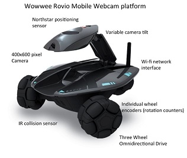

# The Driver for Rovio Wowwee
`Cmake` `C++` `driver` `Linux`

The driver is under **linux**, and I test it with **ubuntu 14.04**. Before you use the driver to control your Rovio, please pay some attention to the below:

## Table of Contents 
-------------------
- [Library Dependencies](#Library Dependencies)
	- [Cmake](#cmake)

        - [Opencv](#opencv)

        - [libjpeg](#cmake)
- [The member function](#the-member-function)
        - [configuration](#configuration)
        - [mobility control](#contributing)
        - [infrared](#contributing)
        - [camera](#contributing)
        - [LED](#contributing)
        - [sensor data](#contributing)
- [Demo](#demo)
      - [The Obstacle Avoiding](#The Obstacle Avoiding)
      - [The camera capture an image](#contributing)
- [For more information](#for-more-information)

## Library Dependencies
----------------------

Before you use the driver, you need to install some dependencies.

### Cmake 
> sudo apt-get install cmake

### Opencv
>sudo apt-get install libopencv-dev

###libjpeg

>sudo apt-cache search libjpeg

>sudo apt-get install libjpeg

## The member function 
-------------------

### configuration

### mobility control

### infrared

### camera

### LED

### sensor data

## Demo
-------------------
### The Obstacle Avoiding
>The demo is to test the IR function. If there is obstacle in front of the Rovio, it will turn left. And it will go forward if there is no obstacle. 

### The camera capture an image

## How to run a demo
-------------------
First you should connect to the Rovio's network, you could use the adhoc model or local lan network, I test the driver with the adhoc model, just  connect to the Wifi(SSID:ROVIO_WOWWEE)

>cd Wowwee

>mkdir build

>cd build

>cmake ..

>make

>cd ../testbin

>./testobstacleavoiding

## For more information
-------------------
- E-mail:[wiform@foxmail.com](wiform@foxmail.com)

---------
Thank you!
:panda_face:

